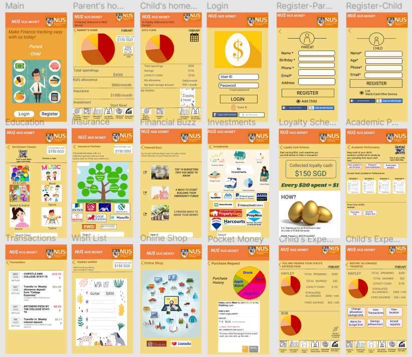
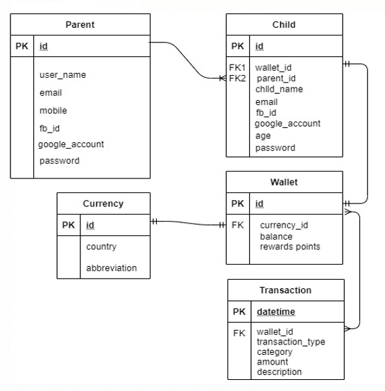

# NUS Money Application
## The NUS Money Application front end is developed in HTML/CSS/JS and uploaded from VSCode to the GitHub Depository. 
## Back end is built in Javascipt using NodeJS.

* **Purpose**
   * NUS Money provides parents with a children expense tracking service through a mobile application platform.
   * The application updates parents instantly with details of the payments made by children, analyse their spending habits and make product recommendations.
* **Design**
   * 
* **Code**
   * ER Diagram
      * 
   * Code Files
      * index.html 
         * Application GUI design
            * Selection Buttons - List Parent / Clear, Select, Update
      * style.css
          * GUI style formatting
      * UpdateParent.js
          * Parent functions 
            * function list_parent() - retrieve list of parent names for dropdown selection
            * function show_parent() - retrieve selected parent details to update fields
            * function update_parent() - update parent record with data from amended field
* **Build** 
   * Back End
      * Build and run main.js to execute NodeJS API function scripts in local host.
        * GET /parent
        * UPDATE /parent/udpdate
        * GET /transaction/by_wallet
        * POST /transaction/addnew
        * DELETE /transaction/delete
        
   * Front End
      * Run Index.html and access API functions through local host port.
* **Test** 
    * Change application title and push to develop branch
    * Push action will activate CI workflow actions
    * Run tasks:
        *  `git checkout --orphan page`
        *  `git reset`
        *  `git add .`
        *  `git commit -m "Update version"`
    * Check workflow action status
        * [Action](https://github.com/myeo1/NUSMoney/actions)
* **Deploy**
    * GitHub Page
        * [NUS Money Page](https://myeo1.github.io/NUSMoney/)

```

